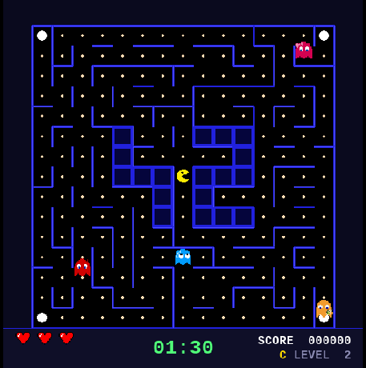

# Hi, I'm Rocío 👩‍💻

Software Development student at 42 Madrid.

## About me

I didn't start my journey in the tech sector, but I decided to pivot toward it because I enjoy understanding how things work under the hood.

At 42 Madrid, I am developing my skills as a software developer through a project-based learning model, where problem-solving, autonomy, and collaboration are essential.

I primarily work with C and Python, while also exploring technologies like C++ and Docker. I am currently focused on strengthening my fundamentals in programming.

## Tech Stack

## Learning...

## Featured projects

### Pacman (Python)

Classic Pacman game implemented in Python.
Focused on game logic, structure and event handling.

### Push_swap Visualizer

Visualization tool for sorting algorithm operations in C.
Helps understand step-by-step stack manipulation.

### Explore more projects in my repositories →

(Falta ordenar repos y ponerlos en publico jiji)

## Contact

- 📧 rocio.hernandez.gu@gmail.com
- 🔗 El LinkedIn que aun no tengo jiji
